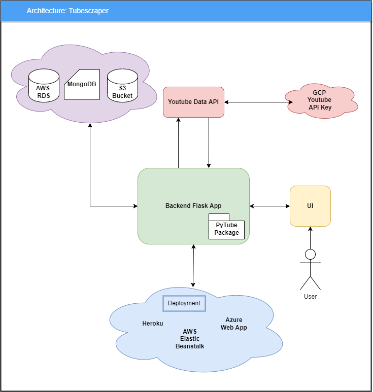
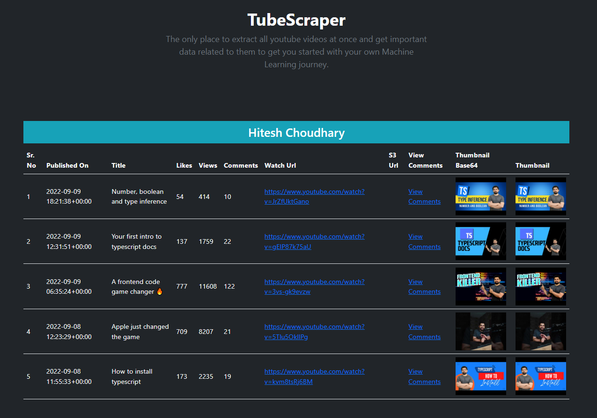

# TubeScraper

This document explains how to set up a development environment, architecture of the application as well as how to use.

## Overview

The below diagram show the overview of how the different systems are connected.

## Getting started with development

- Clone this repo
- Create virtual environment (e.g. establish PyCharm project and set/create interpreter)

### Install requirements

    pip install -r requirements.txt

### Environment variables

Set the value of following environment variable for local as well as deployment environment

`AWS_MYSQL_HOST`: Host address for your AWS MySQL database

`AWS_MYSQL_MASTER_USER`: MySQL User Name

`AWS_MYSQL_MASTER_PASSWORD`: MySQL Password

`BUCKET_NAME`: S3 Bucket Name

`GCP_TUBESCRAPER_API_KEY`: Youtube's API key to access youtube data.

`MONGO_CONNECTION_STRING`: Connection string of MongoDB client

`S3_ACCESS_KEY_ID`: User access key which have access to S3 Bucket 

`SECRET_ACCESS_KEY`: User access key secret

## Database Schema

### AWS RDS - MySql 

1. Youtuber Table 
   
   | chanel_id      | channel_name |
   | ----------- | ----------- |

2. Video Table

   | chanel_id   | video_id | title | youtube_link | s3_link | likes | video_id |comments_count | views | thumbnail_url |
   | ----------- | -------- | ----- | ------------ | ------- | ----- | -------- | ------------- | ----- | ------------- |

### MongoDB
   
      record = {
         'video_id'  # id from sql video table
         'thumbnail_base64'
         'comments': [
            {
               'comment_author'
               'message'
               'replies': []
            }
         ]
      }

## Run the application

    python app.py

# Deploy
make below link hyperlink
## Heroku

    https://tubescraper.herokuapp.com/

## AWS

    http://tubescraper-env.eba-2sxmj2u9.ap-south-1.elasticbeanstalk.com/

## Azure

    https://tubescraperwebapp.azurewebsites.net/

# Use Tubescraper

Browse to the home page of the application and enter the video url of any channel for which the data needs to be 
extracted

1. **Video Url**: Url of the video of a channel for which the data needs to be fetched. It supports the different url 
   patters like below mention. It should be a youtube.com domain & must be a 'watch' endpoint with parameter 'v'. 
       
       
       `https://www.youtube.com/watch?v=QXeEoD0pB3E`
       
       `https://www.youtube.com/watch?v=FHfZ5X7qn1I&list=PLsyeobzWxl7pGh8x5C2hsu3My4ei-eX1Y`
       
2. **No. of videos to scrape**: Max limit is set to be equal to or less than 50 videos. However there is a maximum limit to fetch 
the data from Youtube API is 256.
   
3. **Upload to S3**: Flag to save the video into S3 bucket. Fetching Stream data from Youtube API takes a lot of 
   time and multiplies as the video count increases and also the process of downloading multiple files from youtube and 
   uploading to S3 is not Asynchronous which causes SESSION TIMEOUT error. 
   Hence it is advisable to set the no. of video count to 1 to test the functionality. Improving this functionality 
   could be the next thing to do.
   

## Output 

