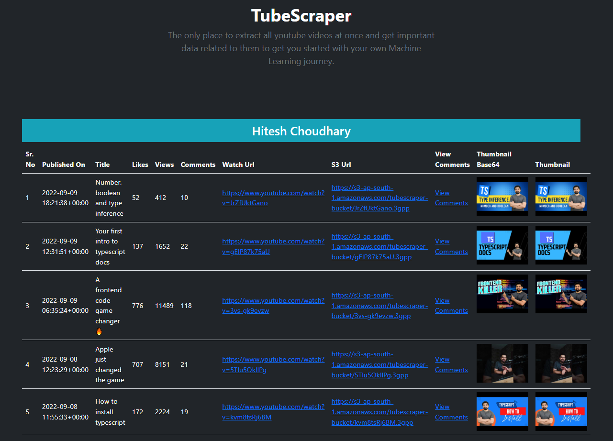
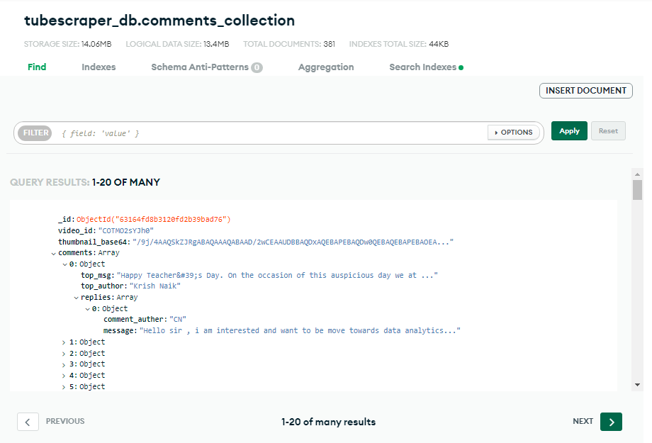
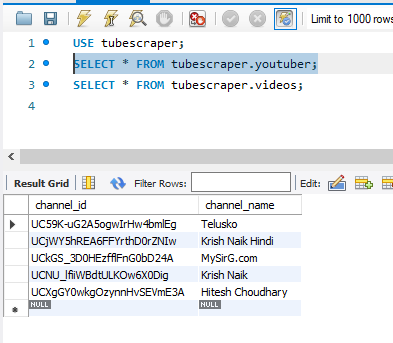
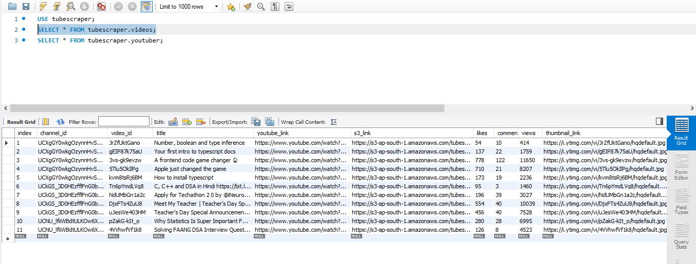

# TubeScraper

This document explains how to set up a development environment, architecture of the application as well as how to use.

## Overview

The below diagram show the overview of how the different systems are connected.

## Getting started with development

- Clone this repo
- Create virtual environment (e.g. establish PyCharm project and set/create interpreter)

### Install requirements

    pip install -r requirements.txt

### Google Cloud Platform 

Make a new project in GCP and enable youtube API. Visit the Enabled APIs page. 
In the list of APIs, make sure the status is ON for the YouTube Data API v3.
The Authentication is done using API Keys.

Visit [https://developers.google.com/youtube/v3](https://developers.google.com/youtube/v3) for more info.

Docs available at [https://developers.google.com/youtube/v3/docs](https://developers.google.com/youtube/v3/docs)
### Environment variables

Set the value of following environment variable for local as well as deployment environment

`AWS_MYSQL_HOST`: Host address for your AWS MySQL database

`AWS_MYSQL_MASTER_USER`: MySQL User Name

`AWS_MYSQL_MASTER_PASSWORD`: MySQL Password

`BUCKET_NAME`: S3 Bucket Name

`GCP_TUBESCRAPER_API_KEY`: Youtube's API key to access youtube data.

`MONGO_CONNECTION_STRING`: Connection string of MongoDB client

`S3_ACCESS_KEY_ID`: User access key which have access to S3 Bucket 

`SECRET_ACCESS_KEY`: User access key secret

`ENABLE_CLOUD_DB` : Boolean flag to specify whether to use cloud database to save data or not 

`MAINTENANCE_MODE` = Boolean flag temporary disable the functionality

## Database Schema

### AWS RDS - MySql 

1. Youtuber Table 
   
   | chanel_id      | channel_name |
   | ----------- | ----------- |

2. Video Table

   | chanel_id   | video_id | title | youtube_link | s3_link | likes | video_id |comments_count | views | thumbnail_url |
   | ----------- | -------- | ----- | ------------ | ------- | ----- | -------- | ------------- | ----- | ------------- |

#### Create Table Query

      videos_create_table_query = f'CREATE TABLE `{MY_SQL_DATABASE}`.`{MY_SQL_VIDEOS_TABLE_NAME}` (
                                  `index` INT NOT NULL AUTO_INCREMENT,
                                  `channel_id` VARCHAR(45) NOT NULL,
                                  `video_id` VARCHAR(45) NOT NULL,
                                  `title` VARCHAR(200) NOT NULL,
                                  `youtube_link` VARCHAR(200) NOT NULL,
                                  `s3_link` VARCHAR(200) NULL,
                                  `likes` INT NULL,
                                  `comments_count` INT NULL,
                                  `views` INT NULL,
                                  `thumbnail_link` VARCHAR(200) NULL,
                                  PRIMARY KEY (`index`),
                                  UNIQUE INDEX `video_id_UNIQUE` (`video_id` ASC) VISIBLE);'
      
      
      youtuber_create_table_query = f'CREATE TABLE `{MY_SQL_DATABASE}`.`{MY_SQL_YOUTUBER_TABLE_NAME}` (
                                    `channel_id` VARCHAR(45) NOT NULL,
                                    `channel_name` VARCHAR(45) NOT NULL,
                                    PRIMARY KEY (`channel_id`),
                                    UNIQUE INDEX `channel_id_UNIQUE` (`channel_id` ASC) VISIBLE)'
### MongoDB
   
      record = {
         'video_id'  # id from sql video table
         'thumbnail_base64'
         'comments': [
            {
               'comment_author'
               'message'
               'replies': [
                  {
                     'comment_author'
                     'message'
                  },
               ]
            },
         ]
      }

## Run the application

    python app.py

# Deploy

Deployment is done on 3 platforms - 

## Heroku
   
[https://tubescraper.herokuapp.com/](https://tubescraper.herokuapp.com/)
    

## AWS
[http://tubescraper-env.eba-kcbwec25.ap-south-1.elasticbeanstalk.com/](http://tubescraper-env.eba-kcbwec25.ap-south-1.elasticbeanstalk.com/)
    

## Azure
[https://tubescraperwebapp.azurewebsites.net/](https://tubescraperwebapp.azurewebsites.net/)
    
## Reset Database Endpoint
As this is a hobby project, deployment is done on free tier of cloud platform. To keep the resources under limit,
this endpoint deletes all data from all the databases as well as video files from S3 bucket.

      GET /admin/db/reset

# Use Tubescraper

Browse to the home page of the application and enter the video url of any channel for which the data needs to be 
extracted

1. **Video Url**: Url of the video of a channel for which the data needs to be fetched. It supports the different url 
   patters like below mention. It should be a youtube.com domain & must be a '/watch' endpoint with parameter 'v'. 
       

`/watch` Endpoints - 
   
      https://www.youtube.com/watch?v=QXeEoD0pB3E

      https://www.youtube.com/watch?v=FHfZ5X7qn1I&list=PLsyeobzWxl7pGh8x5C2hsu3My4ei-eX1Y

      https://www.youtube.com/watch?v=2fXQvy0kFak&ab_channel=HiteshChoudhary

      https://www.youtube.com/watch?v=EMEvheCVhMk&list=PL7ersPsTyYt2Q-SqZxTA1D-melSfqBRMW&ab_channel=MySirG.com
   

`/user` Endpoint 

      https://www.youtube.com/user/krishnaik06

      https://www.youtube.com/user/saurabhexponent1/videos

`/c` Endpoint 
      
      https://www.youtube.com/c/HiteshChoudharydotcom

      https://www.youtube.com/c/Telusko

`/channel` Endpoint

        https://www.youtube.com/channel/UCjWY5hREA6FFYrthD0rZNIw

       
2. **No. of videos to scrape**: Max limit is set to be equal to or less than 50 videos. However there is a maximum limit to fetch 
the data from Youtube API is 256.
   

3. **Upload to S3**: Flag to save the video into S3 bucket. Fetching Stream data from Youtube API takes a lot of 
   time and multiplies as the video count increases and also the process of downloading multiple files from youtube and 
   uploading to S3 is not Asynchronous which causes SESSION TIMEOUT error. 
   Hence it is advisable to set the no. of video count to 1 to test the functionality. Improving this functionality 
   could be the next thing to do.
   

## Output 

